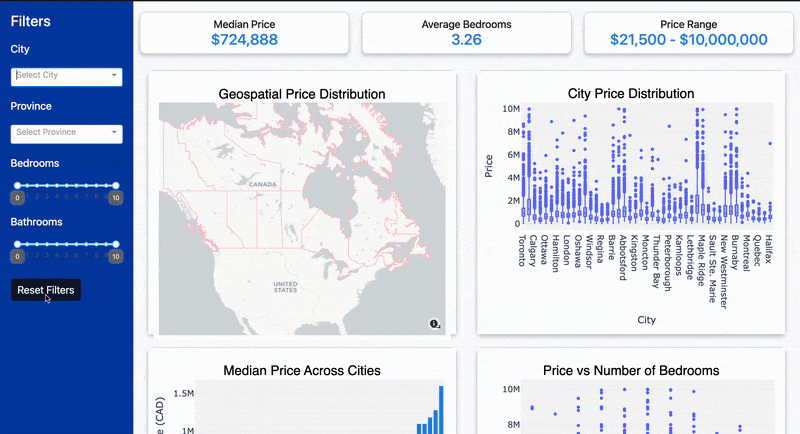

# Canadian House Prices Dashboard

Welcome to the **Canadian House Prices Dashboard** repository for DSCI 532 (2025)! Our group has developed an interactive dashboard to explore housing price data across Canada's top 45 cities. Whether you’re a homebuyer, investor, or policymaker, this dashboard is designed to offer valuable insights into the Canadian real estate market.

## Demo

Check out our dashboard in action:

[](images/demo.gif)

## Deployed Dashboard

Explore the live dashboard here:  
[https://canadian-house-prices.onrender.com/](https://canadian-house-prices.onrender.com/)


## Group Members

- Hui Tang
- Dominic Lam
- Colombe Tolokin
- Fazeeia Mohammed

## Project Overview

The dashboard allows users to:

- **Visualize Housing Trends:** Compare house prices and related features across major Canadian cities.
- **Explore Data:** Filter data by city, price range, number of bedrooms/bathrooms, and other key variables.
- **Support Decision-Making:** Provide insights for homebuyers, investors, and policymakers.

### Prerequisites

- [Git](https://git-scm.com/)
- [Conda](https://docs.conda.io/en/latest/) (or an alternative Python environment manager)

## Getting Started

1. **Clone the Repository:**
   ```bash
   git clone https://github.com/UBC-MDS/DSCI-532_2025_18_canadian-house-prices.git
   cd DSCI-532_2025_18_canadian-house-prices
   ```
2.	**Set Up the Environment**:
	```bash
	conda env create -f environment.yml
	conda activate canadian_house_prices 
    ```
3. **Run the Application**:
	```bash
	python src/app.py
    ```

4. **View the Dashboard**:
Open your web browser and navigate to http://127.0.0.1:8050/ (or the URL indicated in your terminal) to see the dashboard in action.

## Contributing

Contributions are welcome, and we appreciate your interest in improving this project! We have a dedicated [CONTRIBUTING.md](CONTRIBUTING.md) file in this repository that outlines:

- Reporting bugs and requesting new features
- Setting up a local development environment
- Our code of conduct and contribution guidelines

Feel free to open an issue or submit a pull request if you have suggestions or find any bugs.


## Future Work

- Further development of the dashboard prototype
- Refinement of visualizations
- Incorporation of user feedback to enhance features and functionality

## License

This project is licensed under the [MIT License](LICENSE.md).

Acknowledgments
- Special thanks to our instructors and peers at UBC-MDS for their guidance and support.
- Inspired by projects such as [STEMMRoleModels](https://github.com/KirstieJane/STEMMRoleModels).