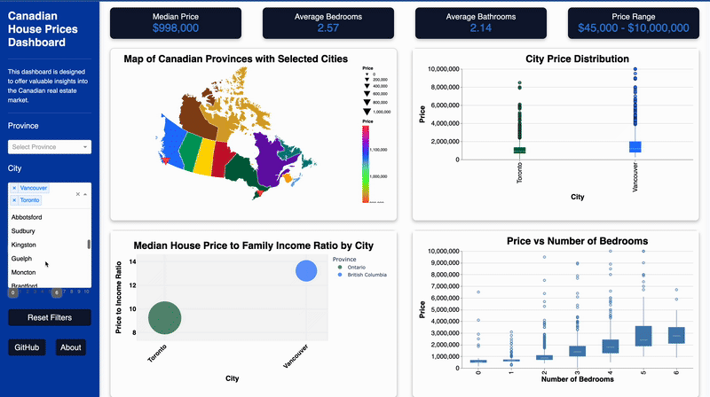

# Canadian House Prices Dashboard

Welcome to the **Canadian House Prices Dashboard**! This interactive tool provides insights into housing price trends across 49 major Canadian cities. Whether you're a homebuyer, investor, or policymaker, the dashboard allows for data exploration and informed decision-making.  

## Motivation and Purpose

The Canadian House Prices Dashboard was inspired by the need to simplify the exploration of Canada’s complex and dynamic real estate market, where housing prices vary significantly across regions. Traditional static reports often fall short of providing interactive, user-driven insights.

Our goal is to offer an accessible and intuitive tool, allowing users to filter and analyze housing data by key attributes such as province, city, number of bedrooms, and bathrooms. The dashboard integrates dynamic visualizations like bubble charts and Altair maps, transforming raw data into actionable knowledge. By making complex data more accessible, this tool empowers users to make informed decisions and explore emerging housing trends with curiosity.

## Project Overview

The dashboard allows users to:

- **Explore Data:** Filter data by city, price range, number of bedrooms/bathrooms, and other key variables.
- **Support Decision-Making:** Provide insights for homebuyers, investors, and policymakers.
- 
## Demo

### Try the Live Dashboard  

Click below to explore housing trends in Canada:

[](images/demo.gif)


## Deployed Dashboard

Explore the live dashboard here:  
[https://canadian-house-prices.onrender.com/](https://canadian-house-prices.onrender.com/)


## Group Members

- Dominic Lam
- Colombe Tolokin
- Fazeeia Mohammed
- Hui Tang

## Prerequisites

- [Git](https://git-scm.com/)
- [Conda](https://docs.conda.io/en/latest/) (or an alternative Python environment manager)


## Getting Started

1. **Clone the Repository:**
   ```bash
   git clone https://github.com/UBC-MDS/DSCI-532_2025_18_canadian-house-prices.git
   cd DSCI-532_2025_18_canadian-house-prices
   ```
2.	**Set Up the Environment**:
	```bash
	conda env create -f environment.yml
	conda activate canadian_house_prices 
    ```
3. **Run the Application**:
	```bash
	python -m src.app
    ```

4. **View the Dashboard**:
Open your web browser and navigate to http://127.0.0.1:8050/ (or the URL indicated in your terminal) to see the dashboard in action.


## Usage

### How to Use the Dashboard

- **Select a city or province** from the dropdown to view its real estate data.
- **Adjust filters** for price range, number of bedrooms, and bathrooms to refine your search.
- **Hover over visualizations** to see detailed insights.
- **Use dynamic charts** to compare housing trends across different locations.  

This dashboard is designed to be intuitive, making it easy to explore, analyze, and interpret Canadian housing data.


## Data Attribution

This project uses data from the [Canadian house prices for top cities](https://www.kaggle.com/datasets/jeremylarcher/canadian-house-prices-for-top-cities) available on Kaggle.


## Contributing

Contributions are welcome, and we appreciate your interest in improving this project! We have a dedicated [CONTRIBUTING.md](CONTRIBUTING.md) file in this repository that outlines:

- Reporting bugs and requesting new features
- Setting up a local development environment
- Our code of conduct and contribution guidelines

Feel free to open an issue or submit a pull request if you have suggestions or find any bugs.


## Future Work

- Incorporation of user feedback to enhance features and functionality  
- Further development and optimization of dashboard performance  
- Additional data sources for more comprehensive real estate insights  
- Refinement of visualizations and improved interactivity


## Acknowledgments

- Special thanks to our instructors and peers at UBC-MDS for their guidance and support.
- Inspired by projects such as [STEMMRoleModels](https://github.com/KirstieJane/STEMMRoleModels).


## Other Reference Repositories

For additional inspiration, we looked at these similar dashboard projects:  

- [Pharmaceutical Spending Dashboard](https://github.com/UBC-MDS/DSCI-532_2025_17_pharma_spend_dashboard)  
- [Road Accident Dashboard](https://github.com/UBC-MDS/DSCI-532_2025_30_road-accident-dashboard)


## License

This project is licensed under the [MIT License](LICENSE.md).


