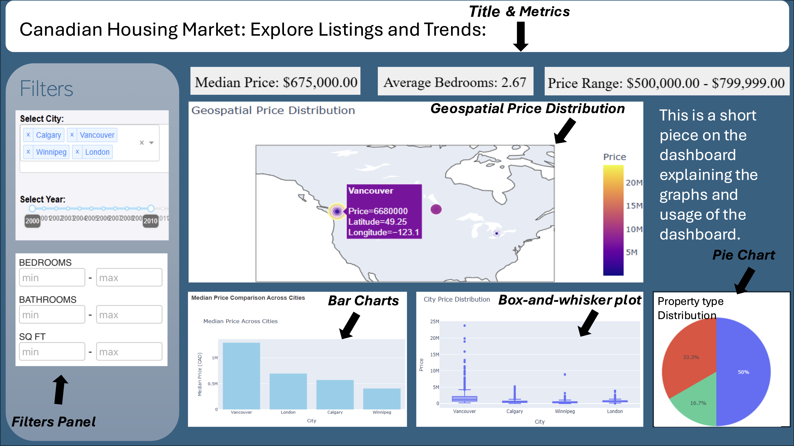

# Proposal for Real Estate Market Analysis Across Canada

**Group Number:** 18  
**Names of Group Members:**  
- Hui Tang  
- Dominic Lam  
- Colombe Tolokin  
- Fazeeia Mohammed  

## Motivation and Purpose:
Joel, an economist with a deep interest in real estate, is conducting a comprehensive analysis of the real estate market across Canada to uncover promising investment opportunities. His primary motivation is to identify cities with the highest potential for price appreciation, ensuring that investments made today can yield substantial profits through future resale or rental income.

Joel is analyzing various cities, comparing their real estate trends and market conditions. By examining fluctuations in city prices, he hopes to identify patterns from the data. The primary purpose of this analysis is twofold:
1. To provide Joel with a clear understanding of where the best investment opportunities lie.
2. To guide his decision-making process when acquiring properties in different cities that are likely to offer optimal financial returns.

## Description of the Data:

This dataset contains housing listing information for 45 major cities across Canada, providing insights into the real estate market in terms of property prices, demographics, and geographical data. The file is structured to allow in-depth analysis of housing trends in relation to city-specific features like population size, family income, and geographic location.

### Data Overview:
The dataset provided consists of the following key variables:
- **City:** The city or metropolitan area where the property is located.
- **Price:** The listed price of each property in Canadian dollars.
- **Address:** The specific location of the property.
- **Number_Beds:** The number of bedrooms in the property.
- **Number_Baths:** The number of bathrooms in the property.
- **Province:** The province where the property is located.
- **Population:** The population of the city.
- **Longitude/Latitude:** Geographical coordinates of the city.
- **Median_Family_Income:** The median household income of the city’s residents.

## Research Questions:
By comparing market trends and price fluctuations, Joel aims to pinpoint areas with the highest potential for price appreciation, making them ideal for real estate investment. The key research questions Joel seeks to address include:

1. **Price Trends:** What are the overall trends in property prices across different cities?
2. **Outliers and Price Ranges:** What are the outliers in property prices, and what do the general price ranges look like for each city?
3. **Geographic Mapping:** How can properties be mapped based on their city locations, with color coding to represent property prices?
4. **Impact of Bedrooms and Bathrooms:** How does the number of bedrooms and bathrooms in a property affect its listed price?
5. **Property Types:** What types of properties are most common in each city?
6. **Price Distribution:** What is the price distribution like within each city?

These insights will allow Joel to better understand the market dynamics, enabling him to make informed decisions about where to invest.

## App Sketch and Description:

**Description of Each Part to Input for Visuals:**
*(This section is for the sketch and description of the visual components you plan to include in the application, such as charts, maps, or other types of data visualizations that will assist in analyzing the real estate market.)*
